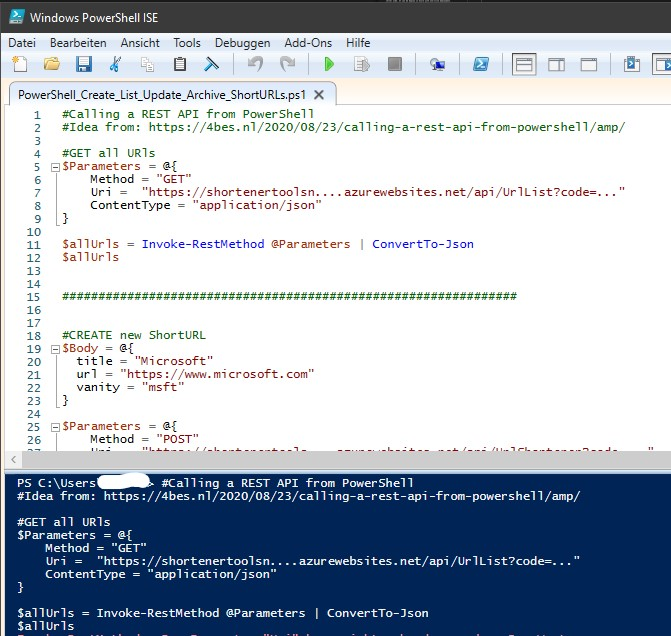

# AzUrlShortener-v1-AdminUIs
AzUrlShortener additional frontends as Admin UI compatible with v1

# Admin frontend for Azure Shortener Urls V1

V1 of the Azure Shortener Urls (AzUrlShortener) didn't require a login to the Azure Functions to e.g. create a short Url.
There is many different ways to calls those Azure Functions from a direct HTTP call to a fancy website. 

Beside the simple API call via Postman and the original Blazor website you will find here some additional frontends with  instructions to deploy and use them with V1.
They are not compatible with V2 which requires AAD login or they need to be implemented in a different way.

---

## List of available V1 Admin frontends

### Postman

Simple use of the API testing tool Postman to call the Azure Functions.

More details [here](https://github.com/FBoucher/AzUrlShortener) on the AzUrlShortner GitHub repository.

### Admin Blazor Website

A simple website that implement the basic functionalities. You can list all URLs and create new ones. The website is done using Asp .Net Core Blazor with a server side. It can be deploy in Azure with one-click deployment.  

More details [here](https://github.com/FBoucher/AzUrlShortener) on the AzUrlShortner GitHub repository.

### [Power Automate Flow](PowerAutomateFlow/README.md)
Very simple PowerAutomate Flows (premium license required) to call the Azure Functions  
More details [here](PowerAutomateFlow/README.md).

### [M365 SharePoint List](SharePointList/README.md)
A simple SharePoint list as Admin UI to create and manage AzureShortener Urls. A Power Automate Flow calls the AzureFunction URLs to create, edit or delete (archive) the AzUrlShortener Urls.

More details [here](SharePointList/README.md).

### [PowerShell](PowerShell/README.md)

Simple use of the API in PowerShell calling the Azure Functions.

More details [here](PowerShell/README.md).

---

